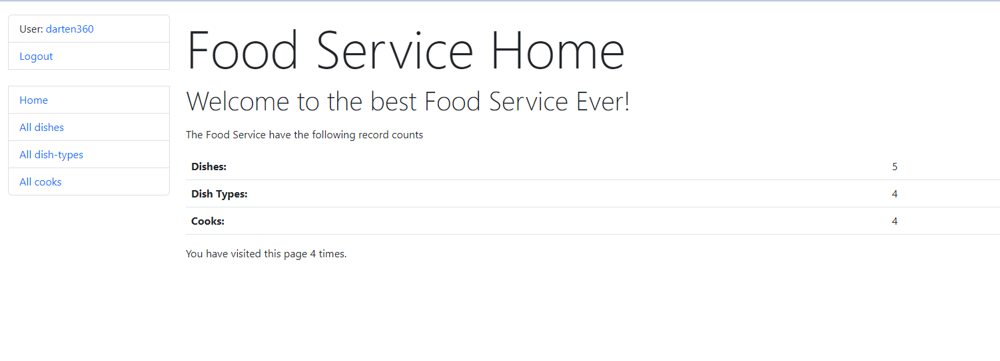

# food-service-darten

Django project for managing dishes, cooks and dish-types

[Food-service project deployed to Blender](https://food-service-v3dh.onrender.com/)

## Installation

```shell
git clone git@github.com:darten360/food-service-darten.git
cd food-service-darten
python3 -m venv venv
source venv/bin/activate
pip install -r requirements.txt
python manage.py runserver
```

## Demo User
```angular2html
username: user
password: user12345
```
## Demo
